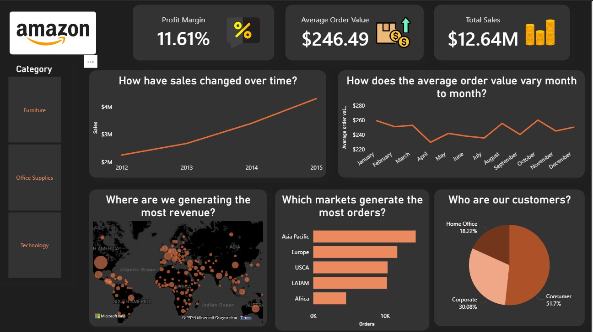

# Amazon-Style Sales Dashboard (Power BI)


## Overview
This project presents an **Amazon-style sales performance dashboard** built in **Power BI**, designed to analyze revenue, profitability, customer behavior, and geographic performance.  
The dashboard focuses on **clarity, business relevance, and minimal clutter**, answering key sales questions at a glance.


## Dashboard Preview



---

## Business Questions Answered
The dashboard is structured to answer the following core questions:

- How have sales changed over time?
- Is the business profitable overall?
- How does average order value vary month to month?
- Which markets generate the most orders?
- Where is revenue being generated globally?
- Who are the primary customer segments?

---

## Key Metrics (KPIs)
- **Total Sales** – Overall revenue generated  
- **Average Order Value (AOV)** – Sales per order  
- **Profit Margin (%)** – Overall profitability  

---

## Visuals Included
- **Sales Over Time** (Line Chart)  
- **AOV by Month** (Line Chart)  
- **Orders by Market** (Bar Chart)  
- **Revenue by Country** (Map)  
- **Customer Segments** (Pie Chart)  
- **Category Slicer** (Furniture, Office Supplies, Technology)

---

## Calculations (DAX)
```DAX
Total Sales = SUM('Orders'[Sales])

Total Profit = SUM('Orders'[Profit])

Average Order Value =
DIVIDE([Total Sales], COUNT('Orders'[Order ID]))

Profit Margin % =
DIVIDE([Total Profit], [Total Sales])
